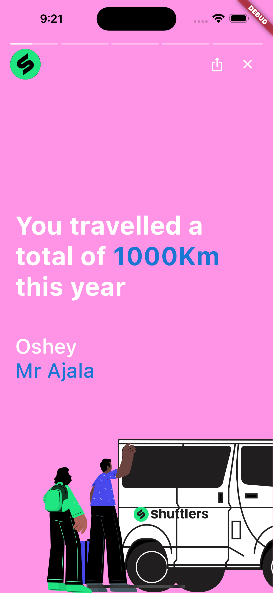

# 🥳🎉 Customized stories package for shuttlers product


A Flutter package for adding stories to mobile apps payments. Fully
supports Android and iOS.

## 📸 ScreenShots

| Image| Image|
|------|-------|
|||
|||
||

## 🚀 Installation
To use this package, add `shuttlers_stories` as a [dependency in your pubspec.yaml file](https://flutter.io/platform-plugins/).


``` dart
import 'package:shuttlers_stories/shuttlers_stories.dart';

```

No other configuration required&mdash;the package works out of the box.

## 📄 Usuage
### 1. Use the pages data to show custom widgets

``` dart

OutlinedButton.icon(
        onPressed: () => StoriesView.instance.show(
        context,
        pages: [
            Container(
            color: Colors.red,
            child: const Center(
                child: Text("A"),
                ),
            ),
            Container(
            color: Colors.orange,
            child: const Center(
                child: Text("B"),
                ),
            ),
            Container(
            color: Colors.yellow,
            child: const Center(
                child: Text("C"),
                ),
            ),
            Container(
            color: Colors.green,
            child: const Center(
                child: Text("D"),
                ),
            ),
            Container(
            color: Colors.blue,
            child: const Center(
                child: Text("E"),
                ),
            ),
        ],
    ),å
    icon: const Icon(Icons.pages),
    label: const Text("Shuttlers stories"),
);

```

| Image| Image|
|------|-------|
|||
|||
||

## 📲 Running Example project
For help getting started with Flutter, view the online [documentation](https://flutter.io/).

An [example project](https://github.com/shuttlershq/flutter_pocket/tree/master/example) has been provided in this package.
Clone this repo and navigate to the **example** folder. Open it with a supported IDE or execute `flutter run` from that folder in terminal.

## 📝 Contributing, 🫠 Issues and 🐞 Bug Reports
The project is open to in house contribution. Please feel very free to contribute.
Experienced an issue or want to report a bug? Please, [report it here](https://github.com/shuttlershq/shuttlers_stories/issues). Remember to be as descriptive as possible.

## 🏆 Authors
- [Mastersam07](https://github.com/mastersam07)